# جلسه 3

## رسم سیگنال به روش منظم

$$
x(t) \rightarrow y(t) = x(at-b)
$$

$$
\begin{cases} x(t) \rightarrow v(t) = x(t-b) \\ v(t) \rightarrow y(t) = v(at) = x(at-b) \end{cases}
$$

---

$$
x[n] \rightarrow y[n] = x(kn-n_0)
$$

$$
\begin{cases} x[n] \rightarrow v[n] = x(n - n_0) \\b v[n] \rightarrow y[n] = v(kn) = x(kn-n_0) \end{cases}
$$

در حالت کلی، $x(\alpha t + \beta)$

$|\alpha| \lt 1$: سیگنال به صورت خطی کش می آید.

$|\alpha| \gt 1$: سیگنال به صورت خطی فشرده می شود.

$\alpha \lt 0$: وارونه می شود.

$\beta \neq 0$: سیگنال جا به جا می شود.

---

<mesal>

#### مثال

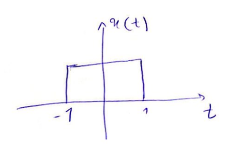

$$
y(t) = x(-2t+3)=?
$$

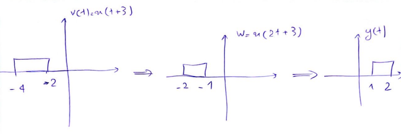

</mesal>

<mesal>

#### مثال

$$
y[n]=x[3n-2]=?
$$

</mesal>

---

<mesal>

#### مثال

$$
x(t) = \begin{cases} 0 \rightarrow t\lt 3 \\ 1 \rightarrow t\geq 3 \end{cases}
$$

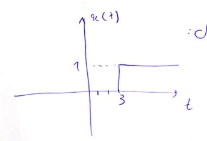

##### الف)

$$
y(t)=x(1-t)

$$

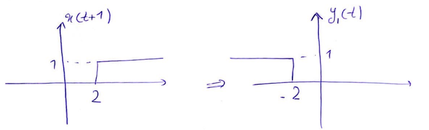

##### ب)

$$
y_2 = x(3t)
$$

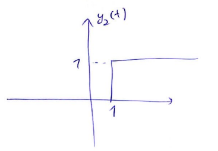

##### پ)

$$
y(t)=x(1-t)+x(t-2)
$$

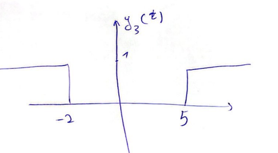

</mesal>

<tamrin>

#### تمرین

1= مطلوب است محاسبه قسمت زوج و فرد سیگنال زیر:

$$
x[n] = \begin{cases} 1 \rightarrow n=0,1,2,3 \\ 0 \rightarrow Otherwise \end{cases}
$$

2= با توجه به شکل $x(t)$ سیگنال‌های زیر را رسم کنید:

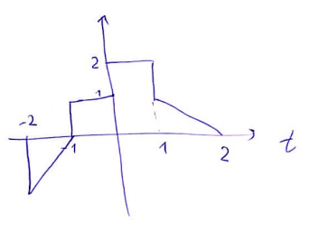

= الف) $x(4-\f t 2)$

= ب) $x(2t+1)$

3 = با توجه به $x[n]$ سیگنال‌های زیر را رسم کنید.
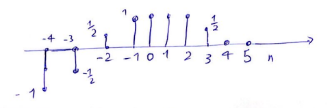
= الف) $x[3-n]$

= ب) $x[3n+1]$

</tamrin>

## معرفی سیگنال‌های مهم

در این قسمت چند سیگنال اساسی زمان پیوسته و زمان گسسته را معرفی می کنیم. این سیگنال ها نه تنها به دفعات پیش می‌آید، بلکه توسط آن‌ها می‌توان سیگنال‌های پیچیده را ساده‌تر تولید و آنالیز کرد.

### سیگنال نمایی

#### زمان پیوسته

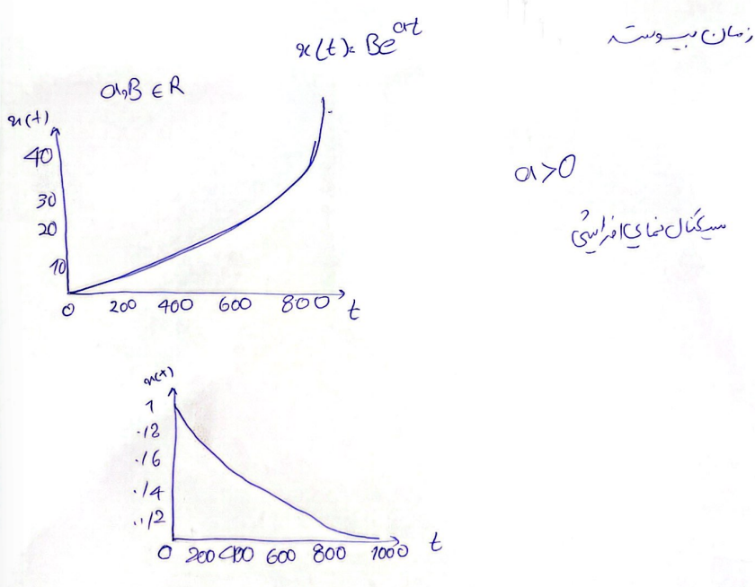

> [!NOTE] نکته
> چنانچه دامنه سیگنال خروجی سیستم با افزایش زمان به طور نامحدود زیاد شود، سیستم تحت بررسی به عنوان سیستم ناپایدار شناخته می‌شود.

### زمان گسسته

$$
x[n]=Br^n
$$

درواقع...

$$
x[n]=Be^{\alpha n } \ra e^\alpha = r
$$

سیگنال نمایی زمان گسسته ؟؟؟ به مقادیر $r$ چهار حالت دارد.

#### 1. سیگنال نمایی افزایشی

$$ r>1 $$
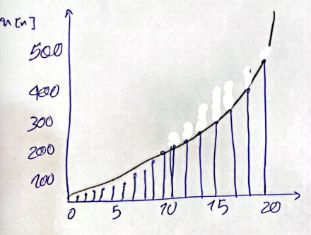

#### 2. سیگنال نمایی کاهشی

$$ 0<r<1 $$
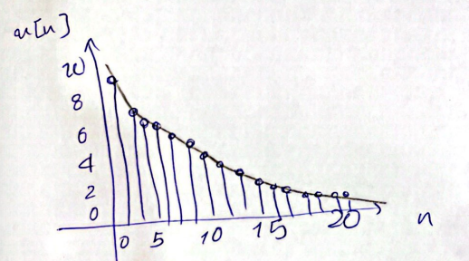

#### سیگنال نوسانی کاهشی

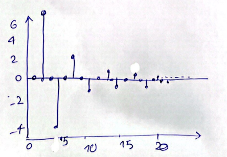

#### سیگنال نوسانی افزایشی

$$r<-1$$
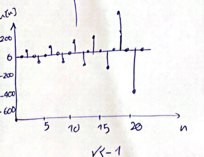

### سیگنال سینوسی

#### زمان پیوسته

$$ x(t)=A\cos(\omega t + \gamma) $$

$$
\omega = 2 \pi f = \f {2\pi} T
$$

> [!NOTE] تکته
> سیگنال سینوسی همواره متناوب با دوره تناوب $T$ است.

<mesal>

##### مثال

$$
x(t) = \cos(\f 1 6 t)
$$

$$
T = \f {2\pi} {\f 1 6} = 12 \pi
$$

</mesal>

#### زمان گسسته

$$ x[n] = A \cos {\Omega n + \gamma} $$
$$ \Omega = 2 \pi f = \f {2\pi} N $$

> [!NOTE] نکته
> سیگنال زمان گسسته سینوسی به شرطی متناوب است که بتوان $N \in Z^+$ را بدست آورد به نحوی که $x[n]=x[n+N]$
> این سیگنال بر خلاف سیگنال زمان پیوسته سینوسی بعضا متناوب نیست.

$$
A\cos (\Omega^n+\gamma) = A\cos ((\Omega (n+N)) + \gamma) = A \cos(\Omega n + \Omega N + \gamma)
$$

$$
\Omega N = 2k\pi \qquad k \in Z
$$

$$ N = \f {2k\pi} \Omega \qquad N \in Z^+ $$

<mesal>

##### مثال

$$
x[n] = \cos [\f {2\pi} {12} n] \ra N= \f {2k\pi} {\f {2 \pi} {12}} = 12 k \qquad k=1
$$

پس $N=12$ به ازای $k=1$ متناوب است.
دوره تناوب اصلی: $N=12$

$$
x [n] = \cos [\f 1 6 n] \ra N= \f {2k\pi} {\f 1 6} = 12 k\pi
$$

متناوب نیست. ($\pi$ یک عدد گنگ است پس $12k\pi$ هیچ وقت یک عدد صحیح نمی‌شود)

</mesal>

### سیگنال نمایی مختلط

#### زمان پیوسته

$$ x(t) = Be^{j\omega t}$$

یا

$$ x(t) = B e^{-j\omega t} $$

---

$$
 x(t) = Be^{j\omega t} = B \cos (\omega t) + jB\sin(\omega t) \qquad \qquad T=\f {2 \pi} \omega
$$

#### زمان گسسته

$$ x[n] = Be^{j\Omega n} $$

یا

$$ x[n] = Be^{-j\Omega n} $$

---

$$
x[n] = Be^{j\Omega n} = B \cos (\Omega n) + jB (\Omega n)
$$

$$
N = \f {2k\pi} \Omega \qquad N \in Z^+ , k \in Z
$$

---

<tamrin>

#### تمرین

= الف) $x(t) = e^{j2t} + e^{j3t}$

= ب) $x[n] = e^{j \f {2\pi} 3 n} + e^{j \f {3\pi} 4 n}$

</tamrin>

### سیگنال سینوسی میرا شونده

ترکیب سیگنال نمایی در سیگنال سینوسی است.
= اگر 2 سیگنال به هم صرب شوند، سیگنالی که دارای دوره تناوب کمتر باشد (فرکانس بالاتر) عمال شکل دهنده نامیده می‌شود (سیگنال حامل). و سیگنال با فرکانس کمتر "پوش" نامیده می‌شود.

> [!NOTE] نکته
> سیگنال نمایی متناوب نبوده و پس از ضرب آن در هر عبارتی باعث می‌شود که سیگنال نهایی متناوب نباشد.

#### زمان پیوسته

$$ x(t) = Be^{at}\cos (\omega t + \gamma) $$

##### سیگنال سینوسی میرا شونده افزایشی

$$ a> 0$$
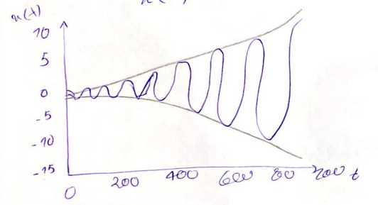

##### سیگنال سینوسی میرا شونده کاهشی

$$ a<0$$
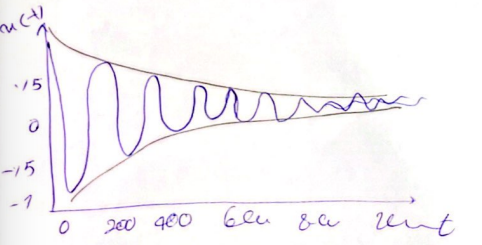

#### زمان گسسته

$$ x[n] = B(r^n) \cos (\Omega n + \gamma) $$

##### سیگنال سینوسی میرا شونده افزایشی

$$ 0<r<1 $$
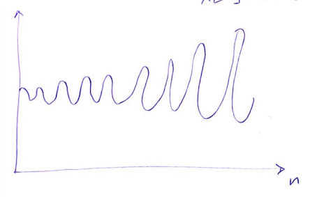

##### سیگنال سینوسی میرا شونده کاهشی

$$r > 1$$

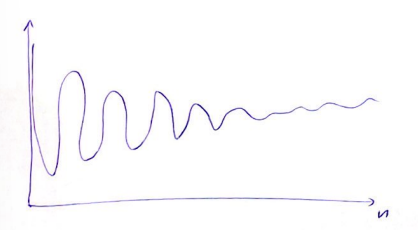

## توابع ویژه

### تابع پله واحد

#### زمان پیوسته

$$
u(t)= \begin{cases} 1 \qquad t \geq 0 \\ 0 \qquad t \lt 0 \end{cases}
$$

#### زمان گسسته

$$
u[n]= \begin{cases} 1 \qquad n \geq 0 \\ 0 \qquad n \lt 0 \end{cases}
$$

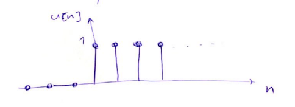

> [!NOTE] نکته
> توابعی که فرم هندسی دارند را می‌توان بر حسب تابع پله بیان کرد.

<mesal>

##### مثال

با توجه به نمودار توابع زیر را به صورت تابع پله بنویسید.

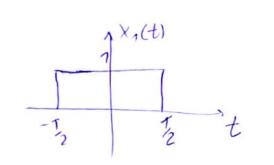

$$ x_1(t) = u(t + \f T 2) - u (t-\f T 2) $$

---

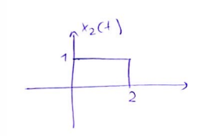

$$ x_2(t) = u(t) - u(t-2) $$

---

$$ x[n] = u[n] - u[n-3] $$

</mesal>

<mesal>

##### مثال

$u[-n + 4]$ را رسم کنید.
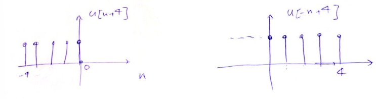

</mesal>

---

<tamrin>

##### تمرین

$u[-n - 4]$ را رسم کنید.

</tamrin>

---

### تابع ضربه واحد (دلتای دیراک)

#### زمان پیوسته

$$
\delta(t) = \begin{cases} 1 \qquad t = 0 \\ 0 \qquad t \neq 0 \end{cases}
$$

$$
\int ^{+\infty} _{-\infty} \delta(t) \d t = \int ^{0^+} _{0^-} \delta(t) \d t = 1
$$

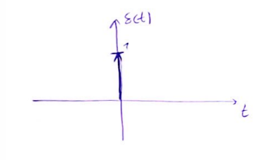

> [!NOTE] نکته
> دلتای دیراک مدل فیزیکی سیگنال‌هایی است که در بازه کوتاه اثر می‌کنند و اثر آن‌ها به انتگرال سیگنال وابسته است.

= مهم‌ترین خاصیت ضربه برای نمونه‌برداری (غربال‌گری) استفاده می‌شود.

= با دانستن پاسخ یک سیستم به سیگنال ضربه می‌توانیم پاسخ آن سیستم به هر ورودی را بررسی کنیم.

#### زمان گسسته

$$
\delta[n] = \begin{cases} 1 \qquad n = 0 \\ 0 \qquad n \neq 0 \end{cases}
$$

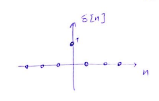

توجه:
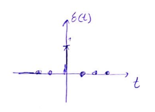

ضریب $a$ را در $a\delta(t)$ قدرت یا توان ضربه می‌گویند.
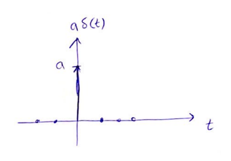

تابع ضربه شیفت یافته

