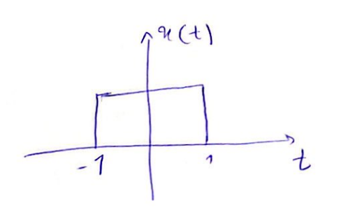
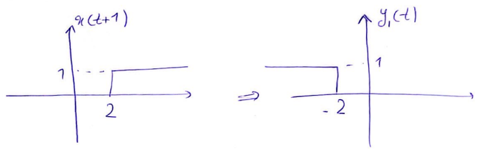
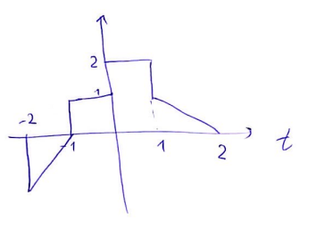
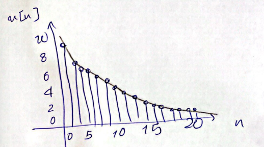

# جلسه 3

## رسم سیگنال به روش منظم

$$
x(t) -> y(t) = x(at-b)
$$

$$
\begin{cases} x(t) -> v(t) = x(t-b) \\ v(t) -> y(t) = v(at) = x(at-b) \end{cases}
$$

---

$$
x[n] -> y[n] = x(kn-n_0)
$$

$$
\begin{cases} x[n] -> v[n] = x(n - n_0) \\b v[n] -> y[n] = v(kn) = x(kn-n_0) \end{cases}
$$

در حالت کلی، $x(\alpha t + \beta)$

$|\alpha| \lt 1$: سیگنال به صورت خطی کش می آید.

$|\alpha| \gt 1$: سیگنال به صورت خطی فشرده می شود.

$\alpha \lt 0$: وارونه می شود.

$\beta \neq 0$: سیگنال جا به جا می شود.

---
#### مثال

$$
y(t) = x(-2t+3)=?
$$

#### مثال

$$
y[n]=x[3n-2]=?
$$

---

#### مثال

$$
x(t) = \begin{cases} 0 -> t\lt 3 \\ 1 -> t\geq 3 \end{cases}
$$

##### الف)
$$
y(t)=x(1-t)

$$

##### ب)
$$
y_2 = x(3t)
$$

##### پ)
$$
y(t)=x(1-t)+x(t-2)
$$

#### تمرین
1= مطلوب است محاسبه قسمت زوج و فرد سیگنال زیر:

$$
x[n] = \begin{cases} 1 -> n=0,1,2,3 \\ 0 -> Otherwise \end{cases}
$$

2= با توجه به شکل $x(t)$ سیگنال‌های زیر را رسم کنید:

 = الف) $x(4-\f t 2)$

 = ب) $x(2t+1)$

3 = با توجه به $x[n]$ سیگنال‌های زیر را رسم کنید.

 = الف) $x[3-n]$

  = ب) $x[3n+1]$
## معرفی سیگنال‌های مهم
در این قسمت چند سیگنال اساسی زمان پیوسته و زمان گسسته را معرفی می کنیم. این سیگنال ها نه تنها به دفعات پیش می‌آید، بلکه توسط آن‌ها می‌توان سیگنال‌های پیچیده را ساده‌تر تولید و آنالیز کرد.

### سیگنال نمایی
#### زمان پیوسته

> [!NOTE] نکته
> چنانچه دامنه سیگنال خروجی سیستم با افزایش زمان به طور نامحدود زیاد شود، سیستم تحت بررسی به عنوان سیستم ناپایدار شناخته می‌شود.

### زمان گسسته

$$
x[n]=Br^n
$$
درواقع...
$$
x[n]=Be^{\alpha n } \ra e^\alpha = r
$$

سیگنال نمایی زمان گسسته ؟؟؟ به مقادیر $r$ چهار حالت دارد.

#### 1. سیگنال نمایی افزایشی

$$ r>1 $$

#### 2. سیگنال نمایی کاهشی
$$ 0<r<1 $$

#### سیگنال نوسانی کاهشی

#### سیگنال نوسانی افزایشی
$$r<-1$$

### سیگنال سینوسی
#### زمان پیوسته
$$ x(t)=A\cos(\omega t + \gamma) $$
$$
\omega = 2 \pi f = \f {2\pi} T
$$

> [!NOTE] تکته
> سیگنال سینوسی همواره متناوب با دوره تناوب $T$ است.
>

##### مثال
$$
x(t) = \cos(\f 1 6 t)
$$
$$
T = \f {2\pi} {\f 1 6} = 12 \pi
$$

#### زمان گسسته
$$  x[n] = A \cos {\Omega n + \gamma} $$
$$ \Omega = 2 \pi f = \f {2\pi} N $$

> [!NOTE] نکته
> سیگنال زمان گسسته سینوسی به شرطی متناوب است که بتوان $N \in Z^+$ را بدست آورد به نحوی که $x[n]=x[n+N]$

$$
A\cos (\Omega^n+\gamma) = A\cos ((\Omega (n+N)) + \gamma) = A \cos(\Omega n + \Omega N + \gamma)
$$

$$
\Omega N = 2k\pi \qquad k \in Z
$$

$$ N = \f {2k\pi} \Omega \qquad N \in Z^+ $$

##### مثال
$$
x[n] = \cos [\f {2\pi} {12} n] \ra N= \f {2k\pi} {\f {2 \pi} {12}} = 12 k \qquad k=1
$$

پس $N=12$ به ازای $k=1$ متناوب است.
دوره تناوب اصلی: $N=12$
